# flink 1.12.0 官网学习总结

## Try flink
### 本地模式安装（略）
### [基于 DataStream API 实现欺诈检测](https://ci.apache.org/projects/flink/flink-docs-release-1.12/zh/try-flink/datastream_api.html)
[详见](src/main/scala/com/bigdata/flink/proj/frauddetect)
```aidl
存在问题：
    下载项目
    mvn archetype:generate \
        -DarchetypeGroupId=org.apache.flink \
        -DarchetypeArtifactId=flink-walkthrough-datastream-scala \
        -DarchetypeVersion=1.12.0 \
        -DgroupId=frauddetection \
        -DartifactId=frauddetection \
        -Dversion=0.1 \
        -Dpackage=spendreport \
        -DinteractiveMode=false
    卡死 
    加 -X 参数，查看具体
    mvn archetype:generate \
        -DarchetypeGroupId=org.apache.flink \
        -DarchetypeArtifactId=flink-walkthrough-datastream-scala \
        -DarchetypeVersion=1.12.0 \
        -DgroupId=frauddetection \
        -DartifactId=frauddetection \
        -Dversion=0.1 \
        -Dpackage=spendreport \
        -DinteractiveMode=false -X
        
    卡在 archetype-catalog.xml 下载
    手动下载 archetype-catalog.xml
    存储到 $MAVEN_HOME/archetype-catalog.xml

功能：自定义source，输出交易流水，keyedProcessFunction 中结合状态进行欺诈失败(小金额体现1$，后面紧随着出现大金额体现1000$，紧随含义1分钟内)。
加工：数据源和输出都已经写好，重点编写报警逻辑 FraudDetector。

知识点：
1.状态：键控状态、算子状态。
2.状态+时间 进行预警键控
```

### [基于 Table API 实现实时报表](https://ci.apache.org/projects/flink/flink-docs-release-1.12/zh/try-flink/table_api.html)
[详见](src/main/scala/com/bigdata/flink/proj/spendreport)
```aidl
下载项目：git clone https://github.com/apache/flink-playgrounds

功能：自定义数据源，输出教育流水到kafka，flink sql映射kafka产生动态表，在其上基于交易时间构建滚动窗口，计算账户最近1小时交易额，结果输出到mysql，grafana 读取 mysql 进行实时监控。
加工：table-walkthrough 设置为maven项目，SpendReport中编写report，实现窗口统计逻辑。数据输出和输出已经写好直接使用。

docker部署：
    cd table-walkthrough 
    docker-compose build 编译镜像(maven、data-generator、table-walkthrough、zk、kafka、mysql、grafana)
    docker-compose up -d 部署容器
    http://localhost:8081 查看flink程序运行 
    docker-compose exec mysql mysql -Dsql-demo -usql-demo -pdemo-sql -D sql-demo 查看mysql数据 select * from spend_report;
    http://localhost:3000/d/FOe0PbmGk/walkthrough?viewPanel=2&orgId=1&refresh=5s 查看grafana的监控大盘
     
存在问题：官网demo中kafka只有一个分区，窗口能够及时关闭。自己基于虚拟机测试时建了3个分区，由于kafka生产数据时(src/main/java/org/apache/flink/playground/datagen/Producer.java)
分区为null，导致部分分区没有数据，及时设置并行度为1，也不能触发窗口关闭。发送kafka消息时将partition设置为key % 分区数 后，保证消息负载均衡，窗口计算就能正常触发执行。

知识点：
1.动态表：基于kafka的source表，基于jdbc的sink表(NO ENFORCED 键的唯一性由使用者自己保证)
2.窗口聚合：TIMESTAMP(3)、TUMBLE、TUMBLE_START
```

### [Flink 操作场景](https://ci.apache.org/projects/flink/flink-docs-release-1.12/zh/try-flink/flink-operations-playground.html#%E6%9F%A5%E8%AF%A2-job-%E6%8C%87%E6%A0%87)
[详细](src/main/java/org/apache/flink/playgrounds/ops/clickcount)
* 部署
```aidl
flink session cluster 、kafka集群
下载
直接下载：git clone --branch release-1.12 https://github.com/apache/flink-playgrounds.git
只取如果已经下载过，执行checkout: git checkout release-1.12

构建镜像
cd ops-playground-image && docker-compose build

启动集群（zk kafka datagen jobmamager taskmanager client）
docker-compose up -d

停止全部容器
docker-compose down -v

停止指定容器 （zookeeper kafka datagen jobmanager taskmanager client）
docker-compose stop kafka
```
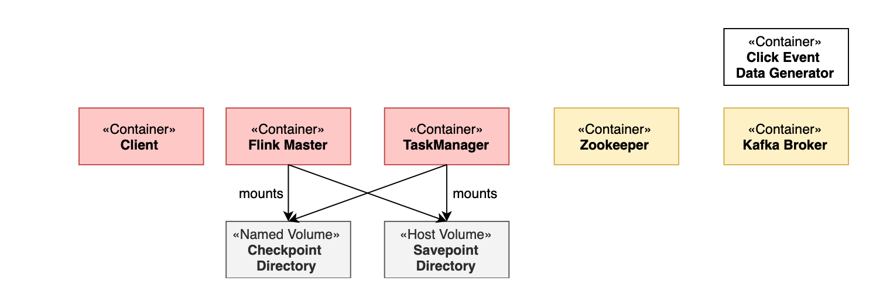
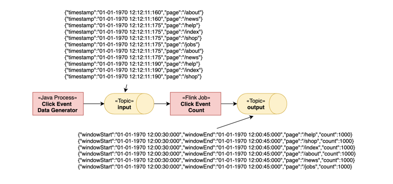

* 日志
```aidl
查看 jobmanager 日志信息，刚启动时会存在大量checkpoint-completed 相关信息。
docker-compose logs -f jobmanager

查看taskmanager 日志信息，具体是干活的
docker-compose logs -f taskmanager
```
* kafka
```aidl
查看 input topic
docker-compose exec kafka kafka-console-consumer.sh --bootstrap-server localhost:9092 --topic input

查看 output topic
docker-compose exec kafka kafka-console-consumer.sh --bootstrap-server localhost:9092 --topic output
```
* restful-api
```aidl
在client节点上运行flink命令
docker-compose run --no-deps client flink --help

查看所有job信息：包括正在运行的可已经运行成功的。
curl http://localhost:8081/jobs
docker-compose run --no-deps client flink list

查看指定metrics
curl http://localhost:8081/jobs/<job-id>/metrics?get=lastCheckpointSize

查看全部metrics
curl http://localhost:8081/jobs/<job-id>
```
* 故障容错
[ClickEventGenerator](src/main/java/org/apache/flink/playgrounds/ops/clickcount/ClickEventGenerator.java)
```aidl
原理：ClickEventGenerator中已经设置好每个窗口内生成所有页面生成1000条记录，flink程序按15s窗口统计6个页面点击数。因此只需要查看taskmanager宕机重启后，
窗口统计依旧连续，且仍为1000条。就能证明消息不多不少，精准一次性消费。

查看正在运行flink程序的job-id
docker-compose run --no-deps client flink list

暴力停机
docker-compose kill taskmanager

现象：
    1.input持续有数据进入; 
    2.output无数据输出; 
    3.http://localhost:8081/ 由于jobmanager还在，因此依旧处理running状态，但taskmanager没有的，处于schedule状态。

重新拉起taskmanager
docker-compose up -d taskmanager

现象：
    1.output有数据输出，且输出速率大于之前平稳计算时速率，因为存在数据积压，因此处理速率比之前高。且统计窗口是延续之前的，中断窗口计数依旧为1000；
    2.http://localhost:8081/ taskmanger重新就绪
```
* 保存点(savepoint)
```aidl
原理：容器都还在，但手动停止运行在flink session集群上作业，停机过程生成保存点目录。然后从此保存点目录重启，结果依旧能够延续之前统计窗口，并且统计数字还是1000条。

获取flink作业的job-id
docker-compose run --no-deps client flink list

手动停机（留意停机产生的savepoint目录）
docker-compose run --no-deps client flink stop <job-id>

查看 save point目录 ，注意ba312f是<job-id>的短id,信息都在 _metadata 文件中
ls -lai /tmp/flink-savepoints-directory/savepoint-ba312f-127c465426e8/

现象：output停止输出；

从保存点目录重启（--checkpointing 开启chkp，--event-time使用时间时间，否则按process-time处理）
docker-compose run --no-deps client flink run -s <savepoint> -d /opt/ClickCountJob.jar --bootstrap.servers kafka:9092 --checkpointing --event-time
 
现象：output延续之前窗口统计，且计数还是为1000。
```
* 扩容容错
```aidl
原理：之前都是单taskmanager运行，即，并行度为1。然后正常停止指定任务（注意是听job，不是停taskmanager），升级并行度为3，发现任务无法正常拉起，增加taskmanager数量到2，任务被正常调起。结果依旧能够延续之前统计窗口，且统计数据还是1000；

获取job-id
docker-compose run --no-deps client flink list

停止指定任务（留意生成的保存点）
docker-compose run --no-deps client flink stop <job-id>

现象：output无结果输出；

修改并行度为3（ -p 3），重新提交作业
docker-compose run --no-deps client flink run -p 3 -s <savepoint> -d /opt/ClickCountJob.jar --bootstrap.servers kafka:9092 --checkpointing --event-time

现象：1.output依旧无数据输出;2.http://localhost:8081 由于设置并行度3，taskmanager数量不够（taskmanager.numberOfTaskSlots: 2）导致无法成功调起任务，不停重试；

对taskmanager进行扩容（slost: 2*2=4 ），这一阶段会先停止所有taskmanager，然后启动2个新的。
docker-compose scale taskmanager=2

现象：1.http://localhost:8081/ 随着新taskmanager注册到jobmanager，任务被成功调起; 2.output 延续之前窗口继续统计，数据还是为 1000；

```
* 反压
[BackpressureMap](src/main/java/org/apache/flink/playgrounds/ops/clickcount/functions/BackpressureMap.java)
```aidl
原理：反压是由于数据消费链路上，某个环节消费比较慢，导致消息处理积压。flink反压是基于高效阻塞队列实现的。BackpressureMap中通过设置延迟实现反压效果。
当时间分钟为偶数时，就会进行手动休眠延迟。从而在webUI 演示反压状态。

获取JobId
docker-compose run --no-deps client flink list

手动停止job(留意savepoint)
docker-compose run --no-deps client flink stop <job-id>

重新启动（--backpressure 开启被压开关，会在之前处理逻辑上添加 .map(new BackpressureMap()), 可以理解为算子变更，但依旧可以基于savepoint还原状态）
docker-compose run --no-deps client flink run -s <savepoint> -d /opt/ClickCountJob.jar --bootstrap.servers kafka:9092 --checkpointing --event-time --backpressure

现象：
    1.output 延续之前窗口继续进行统计；
    2.http://localhost:8081 backpressure-map之前的算子出现背压，观察backpresure 周期性进入被压状态，metrics中 outputPoolLength 和 output

背压：
webui找到上游进多，下游出少的算子，选择backpressure，开始以50ms间隔抽样100次，扫描到背压状态次数占比，介于 0~0.1 ok (无背压)，0.1~0.5 low 低背压，0.5~1 高背压。
```
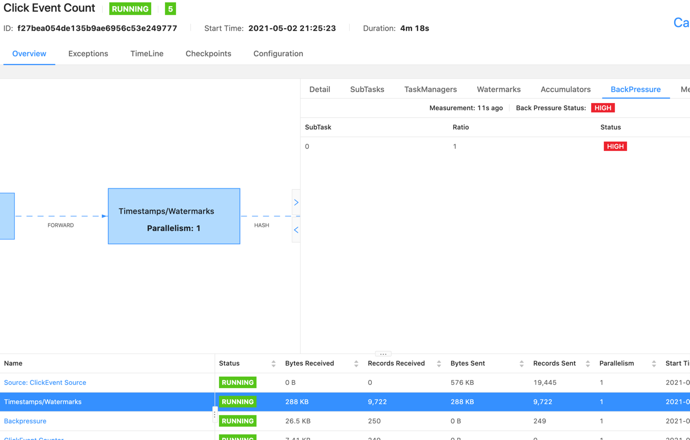

## 实践练习
### [概览](https://ci.apache.org/projects/flink/flink-docs-release-1.12/zh/learn-flink/)
* 流处理
```aidl
批处理：所有数据收集完然后进行处理；（有界流）
流处理：有窗口的场景，以窗口为单位处理数据，无窗口的创建，来一条处理一条。（source > transform > sink）
```
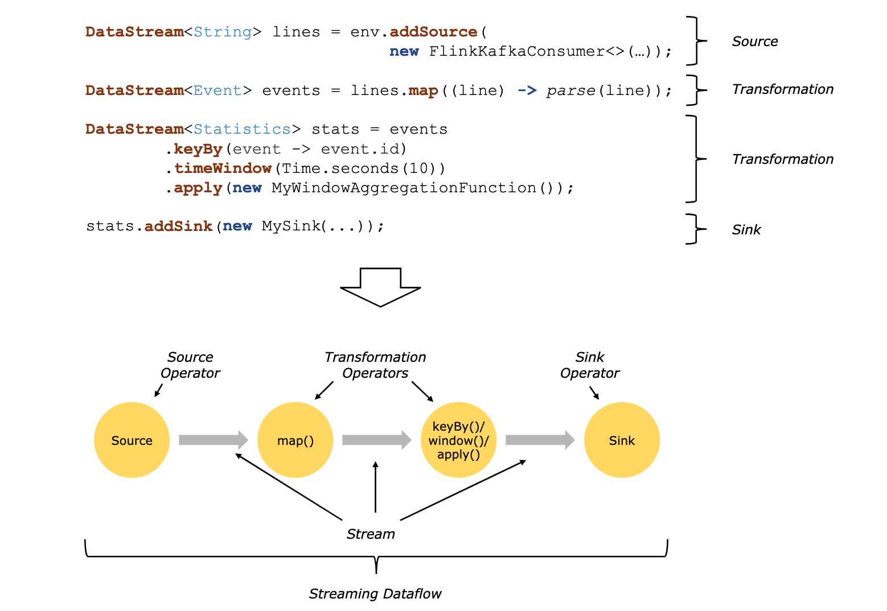
* 并行 dataflow
```aidl
含义：数据处理流程中每个算子都有其对应的一个或多个算子任务，这些任务往往分部在不同线程(同taskmanager不同slots)、或不同容器（不同taskmanager），或不同机器（不同taskmanager）上执行，且都是并行执行的。
各算子子任务领一分区数据单独执行。

算子并行度：算子的子任务数即为该算子的并行度；

整个job并行度：取决于做大并行度算子。

分配并行度：从分配资源角度上给与任务的最大可行并行度；
实际并行度：任务实际使用的并行能力（资源给力不一定都用上了）。

一对一模式：上下游算子子任务处理数据完全是一样的 source[1] -> map[1]，唯一差别在于是在不同线程中执行的；
重分发模式：下游算子子任务接收上游算子多个子任务的数据，进行处理，存在shuffle。
```
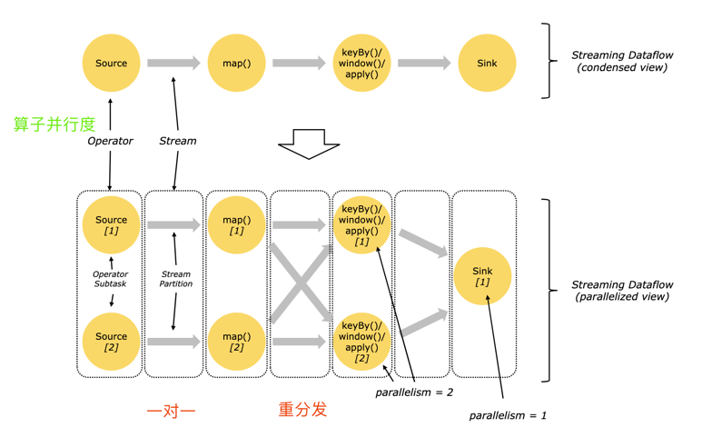
* 自定义时间处理
```aidl
使用数据自带时间信息处理数据，此时间称为时间时间EventTime，此外还有类似于spark的处理时间ProcessTime。和到达系统的摄入时间InjectingTime
```
* 有状态流处理
```aidl
含义：当前数据的处理，取决于之前收到的数据。即每次处理当前的，都需要翻旧账。由于是并行处理，状态通常保持在状态后端，直接有算子子任务在本地发起对状态后端的访问。
flink状态访问都是在本地(状态在taskmanager的JVM堆空间或磁盘上，而checkpoint数据存储在jobmanager的内存、文件系统、RocksDB)；状态太大时也可以存储在结构化数据格式高速磁盘上。
```
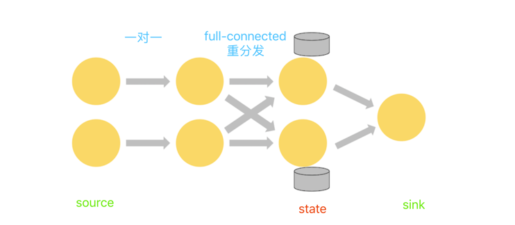
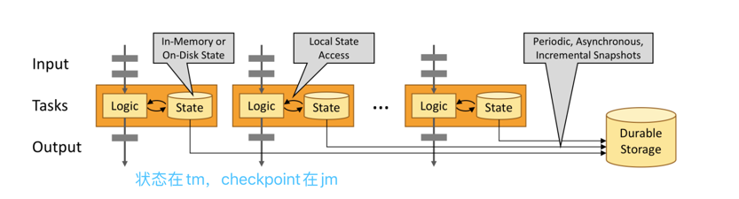
* 通过状态快照实现的容错
```aidl
流处理：基于状态快照和流回放实现精准一次性消费。
批处理：基于全量数据回放实现精准一次性消费，避免繁重checkpoint操作，正常处理效率高，但故障恢复可能比较慢。
```
### [DataStream API 简介](https://ci.apache.org/projects/flink/flink-docs-release-1.12/zh/learn-flink/datastream_api.html)
* 什么能够被转换为流
```aidl
1.能够被序列话的数据，就能转变为流；

2.flink支持的序列化器
基本数据类型：Integer、Boolean、String、Long、Array;
复合数据类型：Tuple、Pojos、Case Class。
序列化器： Kyro、Avro、其他；
```
* stream执行环境
```aidl
1.DataStream API将本地代码转换为StreamGraph（最贴近用户代码的实现，无并行度概念），然后对齐进行优化生成JobGraph（并行度、算子链），然后附着在env上，
打包发给JobManager。当在client上提交时，上面优化操作在client上完成；
2.JobManager将JobGraph转换为ExecutionGraph，并生成具体执行计划，然后调度任务到taskmanager上执行。
```
[执行环境](images/概念/stream执行环境.png)
* 调试
```aidl
IDE开发：直接打断点，或使用WEBUI启动，查看日志；
真实环境部署：通过查看JobManager、TaskManager日志分析故障原因。
```
* [Taxi实战](src/main/scala/com/bigdata/flink/proj/taxi)
```aidl
小时滚动窗口统计收到小费最高的司机
过滤出启动2h未结束的行程
过滤出出发点和结束点都在NewYork的行程
行程单与费用流水join

知识点：
1.SourceFunction中声明事件和水印；
2.借助方法推算定时器时间，减少状态定义；
3.地理位置换算；
4.connect实现流join；
5.junit测试用例使用
```

### [数据管道 & ETL](https://ci.apache.org/projects/flink/flink-docs-release-1.12/zh/learn-flink/etl.html)
* 无状态转化
```aidl
map：进一个元素出变为另外一个元素，前后元素类型可以不同；
flatMap：进一个集合，出变为一个元素，前后元素类型是一致的
```
* keyedStream
```aidl
作用：对数据进行分组，类似于sql中group by，不一定只有kv才能执行key by，单元素也可以。
shuffle过程存在网络通信、序列化、反序列化。
```
* 有状态转化
```aidl
场景：对当前数据的处理取决于之前收到数据。通常在RichXxxFunction中使用，通过getRuntimeContext 创建，.update 访问，.clear清空。
使用最多的是键控状态，键有无穷个的话，理论上状态也是无穷大。算子状态，常在source和sink中使用。reduce中有隐式状态存在。

flink参与状态管理的好处：
1.本地访问，状态存在在taskManager本地，具有内存级别访问速率；
2.状态是容错的，借助checkpoint和流重放机制可以在分布式无事务环境下实现数据处理一致性；
3.支持纵向扩展，执行内存、文件系统、RocksDB三种插拔式状态后端，且RocksDB可以通过挂载硬盘进行扩容；
4.支持横向扩容，支持修改并行度，动态重分部Key和key的状态到新节点；
5.可查询，支持以flink api方式查询状态。
注：当然状态无非就是数据，也可以收到存储到其他外存，自行管理，并不一定要使用flink的状态管理。
```
* connectedStream
```aidl
connect可以连接两个keyedStream，然后在RichCoFlatMap或KeyedCoProcessFunction中实现流动态拼接，或一个流指导另一个流处理(配置驱动)使用场景
```
### [流式分析](https://ci.apache.org/projects/flink/flink-docs-release-1.12/zh/learn-flink/streaming_analytics.html)
* EventTime & Watermark
```aidl
事件时间：数据中自己带的时间；
摄入时间：flink读取数据时间；
处理时间：数据被算子处理的时间。

Watermark机制: flink程序摄入元素时，在对应的时间上进行一定延迟妥协，一定程度上保证对窗口内乱序数据的兼容性。
注：1.如果确定数据不会发生乱序，则Watermark就可以设置为真实时间，即延迟为0；
2.对于延迟会动态变更场景，也可以设置动态水印，基于最近处理数据的延迟情况，动态决定数据延迟阈值，在计算时效性和准确性上折中。但绝大部分情况下固定延迟可满足需求。
3.watermark(t)，即代表时间t之前的数据都已经到达，之后到达的即便小于t，也不会加入计算，触发允许处理迟到数据allowLateness()，或通过 侧端输出采集迟到数据
交给补偿逻辑处理。
```
* window
```aidl
计数窗口：countWindow 按元素个数统计窗口；
时间窗口：timeWindow 按时间段划分窗口；

分区窗口：keyBy后面是有，用于对分区内元素进行处理，提升数据并行处理能力；
全窗口：无需挂载keyBy后面，因此无法享有分区的并行优势，通常可以爱爱keyBy.window后继续挂载windowAll，实现小聚合后大聚合效果；

滚动窗口：TumbleWindow(size)， 左闭右开，元素无重复；
滑动窗口: SlidingWindow(size,interval)，左闭右开，元素有重复，当interval>size时元素会丢失；
会话窗口: SessionGapWindow(gap)，仅在时间窗口上使用，当相邻元素间隔超过阈值时，就归属为两个窗口，gap可以设置为固定间隔，亦可设置为动态间隔。

注：1.窗口相关API除了window(定义窗口)外还有，trigger() 定义何时出发计算、evictor()定义合适删除元素、allowLateness(time) 迟到容忍阈值、
sideOutputLateDate(outTag) 迟到数据输出；
2.滑动窗口通过复制实现，例如：间隔15min统计最近24h的事件，每个事件将被复制到：(1h/15min)*24 = 96 个窗口中； 
3.时间相关的窗口都是整点对齐窗口，在定义窗口时通过设置offset，也可以不整点对齐；
4.窗口后面可以继续挂窗口计算；
5.空窗口不会触发计算；
6.reduce()、agregate() 基于窗口进行增量计算，来一个元素就会计算一次，等到窗口触发时，可以直接输出数据，因此效率更高。而proecss会先把数据憋起来，
等窗口触发时，一次性处理整个窗口数据，计算效率低下，会导致内存溢出、慎用；
7.ProcessWindowFuntcion中的context，除常规可以获取window、currentProcessTime、currentWatermark外，还可以拿到keyState、globalState这
两个key的当前窗口状态，以及key的所有窗口状态。
```
### 事件驱动
* 处理函数
```aidl
与RichFlatMapFunction类似，在state基础上添加了timer。
注：flink为RocksDB提供了经过优化的ListState和MapState，在采用RocksDBStateBackend情况下，使用ListState、MapState比ValueState效率更高，
RocksSttateBackend可以直接附着在ListState上，MapState中的kv则直接对应一个RocksDB对象。因此访问MapState变得更加高效。
```
* 旁路输出
```aidl
借助旁路输出，可以获取迟到数据，或定向过滤需要数控，实现流的n种自定义切分使用。
```
### 通过状态快照实现容错处理
* State Backend
```aidl
1.keyed state状态是以分片形式存储的，所有key state的工作副本存储在taskmanager本地。此外operatoe state也分布式保存taskmanager本地节点上；
2.flink定期获取所有状态，保存到对应持久化位置，如：文件系统、RicksDB。出现故障时，应用程序回拨到最近的状态，然后流回放，实现对故障的兼容；
3.状态后端分类 (基于磁盘、基于堆内存)
RocksDBStateBackend: 状态存储在本地磁盘，备份到远程文件系统，支持增量/全量快照，适合大KV，大状态场景，比基于堆内存状态慢10倍；
FsStateBackend：状态存储在本地节点堆内存，备份到远程文件系统，只支持全量快照，适合比较大状态计算，但需要也需要较大内存支持，会受限与GC；
MemoryStateBackend: 状态存储在本地堆内存，备份在JobManager的对堆内存，只支持全量快照，运行效率极高，仅在实验、测试环境下使用，故障会导致数据丢失，生产慎用。

注：上面所说的所有状态后端都可以进行异步执行快照。
```
[状态后端](images/概念/状态后端.png)
* 状态快照
```aidl
1.flink source不停在数据流中插入barria，标记当前数据流时间进度，以kafka为例，barria的数值是barria之前当前分区最大消息的offset；
2.barria到达中间算子时，中间算子就记录状态，标识其处理数据进度；
3.中间算子如果有多个输入时，barria提前到达的输入源停止处理数据，等待后面其他输入源barria，等待过程称为barria对齐，当所有barria到达后，此中间算子才开始记录状态。
等待期间，数据憋在缓冲区。barria开始对齐后，重新开始处理数据；
4.barria到达sink算子时，sink依旧会先对齐barria,然后写状态，向jobmanager汇报处理进度，当数据处理到一定进度，jobmanager触发checkpoint，
通知taskmanager执行checkpoint操作，拷贝所有算子最新状态到状态后端。
5.发生故障时，优先从taskmanager本地读取落盘的状态副本进行恢复，本地不存在时，从远处状态后端拉取，将程序整体设置为最近的某个检查点，然后结合流重放，实现故障恢复。
```
[状态快照如何工作](images/概念/状态快照如何工作.png)
* 精准一次性
```aidl
at-most-once: 最多处理一次，flink程序出现故障，数据消费暂停，直接从最新开始读取，数据会丢失；
at-least-once: 最少处理一次，由于缺少barria对齐，数据会重复消费；
exactly-once: 精准一次性消费，出现故障，整体回拨发到最近检查点，然后让source从最近检查点开始重放，数据消费不重不漏；
```
* 端到端一致性
```aidl
由于flink程序只是数据处理的一个中间环节，因此端到端一致性，还需要考虑source，sink数据源特性；
source: 可定点回放，且自身数据最好有去重能力(如：kafka producer 可以实现事务写入、分区存储数据时开启幂等写入配置)，否则flink程序需要做去重处理；
sink: 支持幂等写入（多次写结果一致）或事务写入（故障自动回滚）。

```
## 概念透析
### [概念](https://ci.apache.org/projects/flink/flink-docs-release-1.12/zh/learn-flink/)
```aidl
SQL -- 最顶层抽象，构建在TableAPI之上，使用最简单
Table -- 声明式编程模型，表达能力比core api稍弱，执行前会有优化器，优化执行逻辑；
CoreApi -- 包含DataStream、DataSet 两种API，表达能力弱于Process API，但也能处理绝大部分逻辑。
StatefulStreamProcessing -- 最底层抽象，表达能力最强，使用有一定门槛。
```
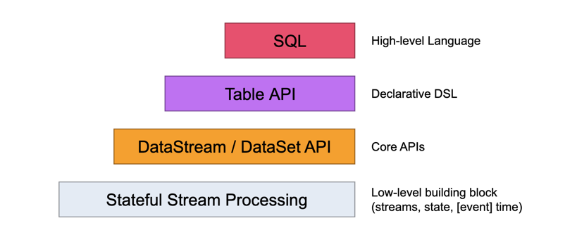

### [有状态流处理](https://ci.apache.org/projects/flink/flink-docs-release-1.12/zh/concepts/stateful-stream-processing.html)
* 状态
```aidl
含义：与处理单个元素算子不同，flink中有些算子需要了解之前处理过元素信息，这样的场景就需要状态算子。
flink 基于状态构建的checkpoint、savepoint操作为其故障容错提供实现途径。
```
* 键控状态
```aidl
含义：通俗可以理解为flink内置的kv存储，并且随流一起分布式存储在分区节点，一个key对应一个状态。flink在dataflow的源头周期性在数据元素中间插入barria，
某算子有多个input输入时，算子一旦接受某个input的barria，就不在继续处理此input元素，而是会等待其他input的barria，直到凑齐所有input的barria，
才开始记录状态，然后对前后barria直接数据进行处理，接着继续处理后一个barria的数据。等待barria过程称为对齐。并且等待期间数据是存储在本地缓冲区，
基于对齐操作实现了无事务条件下一致性保证。

常见键控状态有：MapState、ListState、SetState、ReduceState、FoldState、AggregatingState。（一个key一个状态）
常见算子状态：MapState，BroadcastState。（算子一个子任务一个状态）
```
* 状态容错
```aidl
flink 基于流重放(stream reply)和保存点(checkpoint)实现故障容错。
1）checkpoint inverval 在数据处理效率和容错恢复时间直接折中，间隔越短，处理效率越低，间隔越长，故障恢复耗时越长。
2）checkpoint默认是关闭，需要手动开启，故障重启依赖checkpoint。
3）snapshot与checkpoint、savepoint等价，含义一样。

flink的checkpoint机制参照分布式数据流轻量异步快照实现，是Chandy-Lamport algorithm的典型应用。

1）分布式数据处理流中，source处flink会周期性往对应分区插入barria，此barria仅仅标识数据处理进度，对算子不敏感。对于kafka输入流而言，barria就对应是
2）它之前最近一条记录的offset。前后相邻barria(n) 和 barria(n-1) 之间对应的就是第n次checkpoint的增量数据。
3）barria一旦进过某中间算子，算子就会对外部发送自己的barria，标记它处理数据进度。
4）某算子有多个input时，不同input的相同编号barria到达算子时间不一致，先到的input，将不在处理数据(流暂停)，等所有input的barria到齐，写完状态后，继续处理下阶段数据。
barria对齐机制保证无事务状态下，分布式数据处理的一致性。
5) barria经过sink算子时，sink写完状态后，向jobmanager报告状态，jobmanager触发checkpoint操作，所有状态收集到jobmanager内存，写到状态后端。出现故障时，jobmanager
调度taskmanager从状态后端获取最新的状态以其为起点，重新回放流实现数据处理恢复。
```
[barria](images/概念/barria.png)
[barria-align](images/概念/barria-align.png)
[checkpoint](images/概念/checkpoint.png)

* savepoint
```aidl
含义：通俗可以理解为用户手动触发的checkpoint，但不同于checkpoint，无过期概念，使用于人为升级场景(代码变更、配置变更、算子变更、框架升级)，停机保存状态到savepoint目录，
处理变更后，从savepoint重新拉起程序，继续从上次位置接着处理。而checkpoint是有jobmanager周期性触发taskmanager完成的，不需要人工参与，适用于故障自动恢复场景。
```

* exactly once & at least once
```aidl
barria align 保证无事务场景下数据处理一致性，维持精准一次性消费语义，但对齐也带来数据处理延迟问题，对于低延迟响应场景，可以配置跳过对齐，从而提升响应效率。但由此带来重复消费问题。
可以通过下游幂等性纠正。
```

* 批处理模型状态容错
```aidl
flink中批处理被当成特殊流处理，所处理的流式有界的。绝大部分适合流处理场景概念，对批处理也适用。但也有以下几点不同：
1.批处理的容错依赖全量数据回放，而不是checkpoint。一方面因为数据有界，使得全量回放可行，另一方面使得常规计算更加轻量、高效，因为毕竟checkpoint是个比较繁重操作，但随着也
带来故障恢复时间比较长问题。
2.DataSet API 状态使用的不是key/value indexer，而是in-memory/out-of-core data structures；
3.DataSet API中介绍的同步迭代操作仅对有界流有用。
```
### [Flink 架构](https://ci.apache.org/projects/flink/flink-docs-release-1.12/zh/concepts/flink-architecture.html)
* Flink 集群剖析
```aidl
部署模式： local、standalone、yarn-cluster；
组件：
JobManager: 接收作业、执行checkpoint、故障恢复。
    Dispatcher：提供rest接口，提交Flink程序执行、并为每一个提交的作业，启动JobMaster，运行WebUI提供作业执行信息；
    JobMaster：负责管理单个JobGraph执行，Flink集群中可能运行多个作业，每个作业都有自己的JobGraph
    ResourceManager: 负责管理flink集群的资源提供、回收、分配，其所管理的task-slot是flink集群资源调度基本单位；

TaskManager：执行JobManager分配给它的作业流上的任务，缓存并交换数据。拥有一个或多个task-slots。
    Slot：内存独占、CPU共享资源抽象单位；

Client：提交作业，非必须的。
```
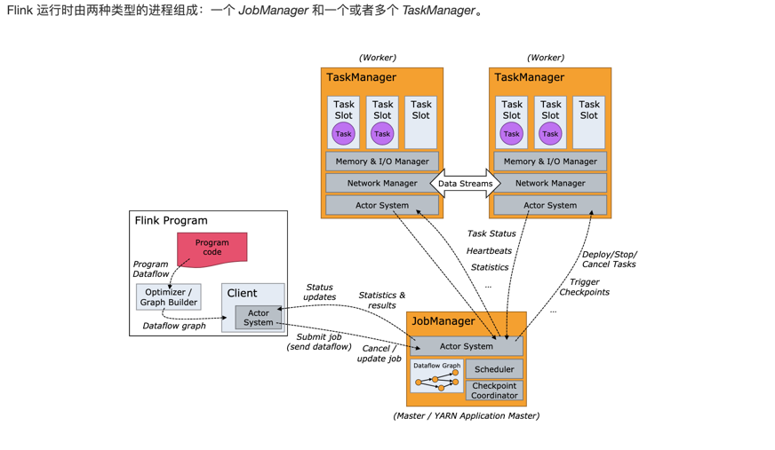
* 算子链
```aidl
同一个slot上相邻运行的算子子任务subtask，在满足一定条件下可以合并为算子链，将分配在不同线程中执行的任务，合并到一个线程执行，减少线程切换、数据在线程之间传输时
缓冲、序列化、反序列化开销。

一个TaskManager对应一个JVM 进程，运行在上面的每一个TaskSlot对应一个线程，同一个JVM中的线程之间共用TCP连接(多路复用)和心跳信息。
```
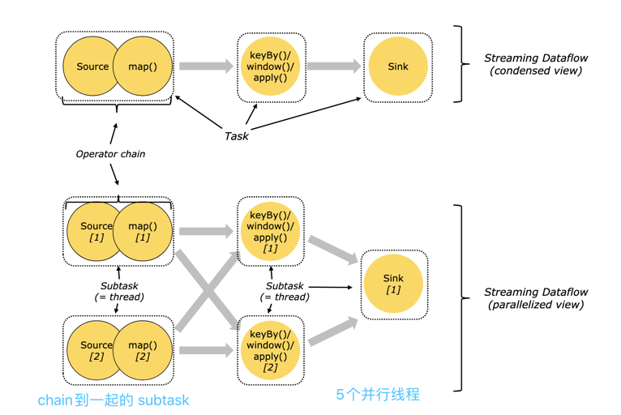
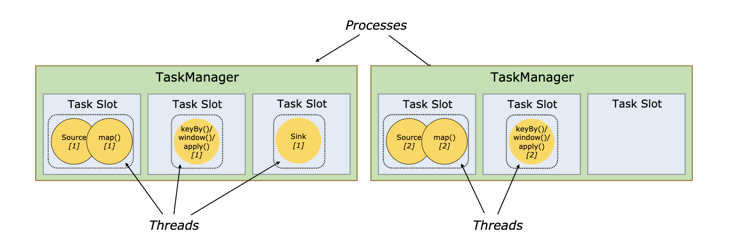
* 资源分配原则
```aidl
1.能chain到一起尽可能chain到一起，减少线程切换，以及数据在线程之间传输开销，如：source map；
2.依据算子是否是计算密集型设置合理并行度，例如：window是计算密集型，需要设置较高并行度，避免处理不过来造成阻塞，而source、map是非计算密集型，在window上游，跟window设置相同并行度就可以。
```
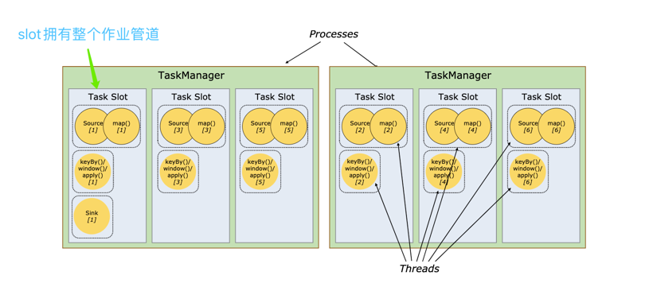
* flink 应用程序执行
```aidl
Flink Session集群：以Standalone部署为例，需要先启动一个flinK集群，然后才能接受客户端提交作业。并且作业执行完毕，Flink集群也不关闭，会常驻，
由于集群实现启动好了，提交作业可以直接计算，因此响应计算快。多个作业直接共用资源。适合计算时间短、资源占用率不高、要求快速响应出结果场景。缺点：
作业直接存在，资源竞争关系，一个作业故障导致JobManager挂掉，所有作业跟着一起挂。（整个集群一个JobManager、多个TaskManager，接收多个作业，
作业之间共用计算资源，一个作业对应生成一个JobMaster，负责调度JobGraph到Slot上运行，一挂全挂）
俗称：Session部署

Flink Job集群：与Yarn部署为例，使用Yarn作为资源调度，每次作业提交都会先在yarn上创建一个flink应用（即JobManager、TaskManager那一套），因此启动时间比较长，
作业直接资源是相互隔离的。可以理解为为每一个作业启动一套（JM,TM），作业执行完毕，集群退出。适合运行：运行时间比较长，占用资源相对较高，且作业直接要有一定隔离的场景。
缺点：启动时间长、结果响应慢、所有作业如果都在一个client上提交，client负责将jar抽象为StreamGraph，然后转换为JobGraph，再提交JobManager将JobGraph转换为
ExecutionGraph，由JobMaster调度到TaskManager的slot上运行。client压力比较集中。（main方法中，execute之前的代码在client上运行，之后代码在JobManager上运行）
俗称：Pre-Job；

Flink Application集群：在Flink Job集群上改进，将整个main方法放在flink集群上执行，而不是在client上执行，避免对client产生冲击。
俗称：Application运行
```
